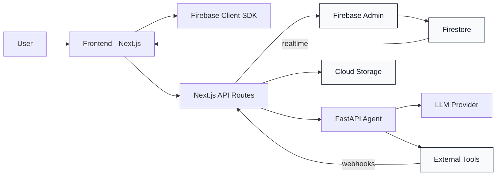
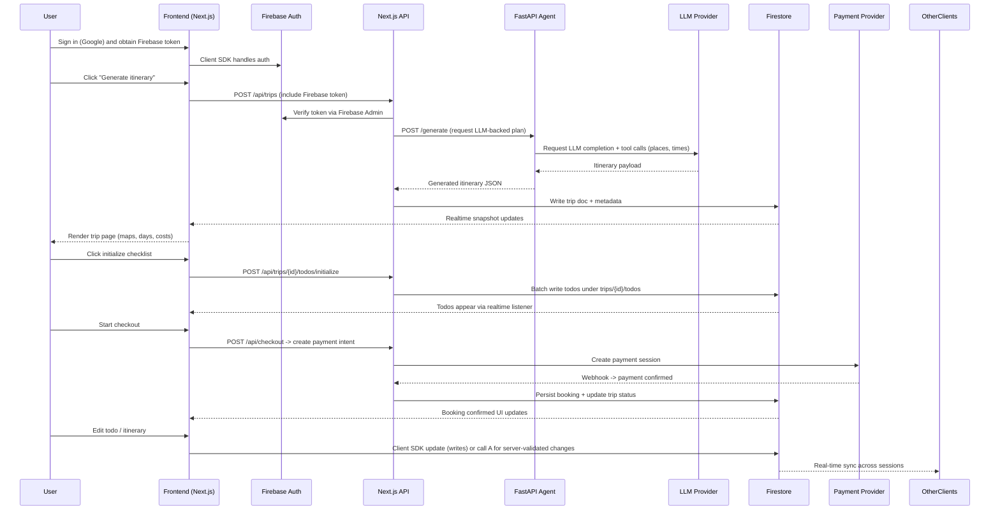

# Tripy — Architecture Overview

This doc contains two diagrams and a short explanation of how Tripy's main parts are organized and how they interact.

---

## 1) Main parts (components)

---

## 2) How these parts talk (sequence)

---

## Architecture details — Frontend

- Framework: Next.js 15 (App Router), TypeScript, React.
- State: Zustand store for auth and trip data; components use hooks (e.g., `useTripTodos`).
- Auth: Firebase client SDK for sign-in (Google) and short-lived ID tokens.
- Data: Realtime listeners (Firestore onSnapshot) for trips and todos; optimistic updates for UI responsiveness.
- UI pieces: Trip page (day-by-day), `TripTodoList` (accordion per day), `TodoWidget` (floating), Chat Assistant component.
- API usage: For server-verified or heavy ops (generation, initialize batch writes, booking), the frontend calls Next.js API routes.
- UX notes: Floating widget uses CSS overlay; accessible keyboard interactions and mobile-friendly layout.

## Architecture details — FastAPI Agent backend

- Role: A separate service responsible for LLM orchestration, tool calls (Places/Maps lookups), and heavier async workflows.
- Deployment: Containerized (Docker) service, can run on the same cloud project or separate host; scale independently from the Next.js frontend.
- Interface: Exposes HTTP endpoints consumed by Next.js API routes (e.g., `/generate`, `/chat`, `/tools/places`).
- LLM & tools: Calls external LLM APIs and third-party services; manages retries, caching, and structured output normalization.
- Async & scaling: Use background job queue (Redis + RQ/Celery or FastAPI background tasks) for long-running jobs and streaming responses.
- Security: Requests from Next.js API are authenticated via a signed service token or mutual TLS; logs are audited and rate-limited.
- Observability: Structured logging, tracing (OpenTelemetry), and metrics for latency and error rates.

## Integration notes

- Authentication flow: Frontend gets Firebase token; Next.js API validates the token using Firebase Admin and only then calls the FastAPI agent (service-to-service auth).
- Data ownership: Trips and todos live in Firestore; Next.js API and FastAPI can write to Firestore via Admin SDK for server-side writes.
- Realtime UX: Frontend relies on Firestore listeners to reflect changes made by any service or client instantly.
- Payments: Next.js API mediates payment provider calls and handles webhooks to mark bookings; sensitive operations never run on the client.

---

If you want, I can:

- Add a simplified PNG export of the Mermaid diagrams and embed them in this file for guaranteed rendering on GitHub pages.
- Create a small README section with commands to run the FastAPI agent locally (Dockerfile + docker-compose example).

*File added: `ARCHITECTURE.md` — diagrams + concise architecture notes.*
