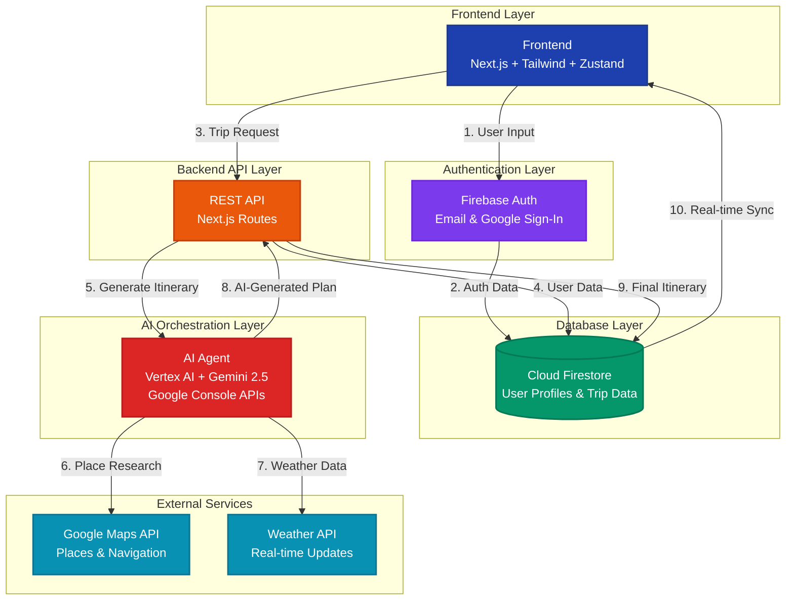

# Tripy - AI-Powered Travel Concierge

> 🤖 **AI Agent Repository**: [tripy-ai-agent](https://github.com/Tripy-001/tripy-ai-agent) - The core AI orchestration system that powers Tripy's intelligent itinerary generation

Tripy is an AI-powered travel concierge that transforms detailed user profiles—covering over 25 preferences like budget and travel style—into hyper-personalized, end-to-end itineraries. Its intelligent backend performs AI-driven research to identify a destination's "must-see" attractions, synthesizes this with real-time mapping data into a thematic daily plan, and can even generate anonymized "showcase" trips with AI-created titles and summaries.

The user journey is delivered through a modern web application where, after a secure sign-in and intuitive onboarding, the final itinerary is generated and displayed. This seamless flow allows the user's interface to transition from a "generating" state to the complete plan, presenting the final trip with interactive maps and live, per-activity weather data for a truly dynamic travel co-pilot experience.

## Our Unique Selling Proposition (USP)

**Our USP is the Hyper-Personalized Synthesis AI Agent**

Tripy doesn't just aggregate data—it synthesizes it. We transform over 25 nuanced user preferences (from budget and pacing to culinary tastes and activity levels) into a narrative-driven, thematic daily plan. We create a trip that feels handcrafted by a local expert, not assembled from a database. We also enrich the itinerary with real-time weather updates that helps the user to plan that day accordingly.

## How Tripy Makes Travel Smarter

1. **Truly Personal Plans**: We go beyond simple keywords. Our platform understands your unique vibe—from your ideal daily pace to what you'd prefer to splurge on—to build an itinerary that truly fits you.

2. **Expert Curation, Instantly**: Tripy acts as your expert guide, instantly researching the best local spots and weaving them into a logical, day-by-day plan with fun themes and amazing food experiences.

3. **A Plan That Adapts to Reality**: Travel is unpredictable. Tripy watches the weather for you and proactively suggests a great indoor alternative if rain is about to spoil your outdoor plans, turning a disruption into a new opportunity.

4. **Everything in One Place**: From booking options to creating beautiful, anonymized versions of your trip to inspire other travelers, the entire journey is integrated into one seamless experience.

## System Architecture

Tripy follows a modern, scalable architecture that seamlessly integrates multiple services to deliver personalized travel experiences:

### Architecture Diagram



### Component Overview

### Frontend (FE)
- **Technology Stack**: Next.js, Tailwind CSS, Zustand
- **Role**: User-facing application that provides an intuitive interface for trip planning
- **Key Features**: Responsive design, real-time state management, seamless user experience

### Authentication Layer
- **Service**: Firebase Authentication
- **Methods**: Email and Google Sign-In
- **Integration**: Direct connection to Firestore for user profile management
- **Security**: Secure token-based authentication with automatic session management

### Database Layer
- **Service**: Cloud Firestore
- **Purpose**: Stores user profiles, trip data, and application state
- **Features**: Real-time synchronization, scalable NoSQL structure, secure access rules

### Backend API
- **Implementation**: Next.js API Routes
- **Functionality**: 
  - Orchestrates data flow between frontend and database
  - Handles business logic and data validation
  - Manages user authentication and authorization
  - Triggers AI-powered itinerary generation

### AI Orchestration Layer
- **Core Technology**: Vertex AI with Gemini 2.5 model
- **Integration**: Google Console APIs for enhanced functionality
- **Process**: 
  - Receives user preferences and destination data from the API
  - Performs intelligent research and synthesis
  - Generates personalized, thematic daily itineraries
  - Validates and formats the final output

### Data Flow
1. **User Input**: Frontend collects detailed preferences through onboarding
2. **Authentication**: Firebase Auth validates user identity
3. **Profile Management**: User data is stored/retrieved from Firestore
4. **API Processing**: Next.js routes handle business logic and data orchestration
5. **AI Generation**: Vertex AI agent creates personalized itineraries
6. **Real-time Updates**: Weather and mapping data enhance the final plan
7. **User Experience**: Seamless transition from generation to interactive trip display

## Key Features

### Deep User Personalization
We go beyond simple destinations by capturing a rich, multi-faceted user profile. Our intuitive onboarding collects over 25 granular data points, including travel style (e.g., adventure, cultural), daily pacing, specific interests (from history to nightlife), and accommodation preferences to understand the traveler's unique vibe.

### Real-Time Place Intelligence
Our platform integrates directly with Google's Places and Maps APIs. This allows us to pull live, dynamic data for any destination, including top-rated attractions, diverse restaurants, hidden gems, and crucial logistical information like coordinates and opening hours.

### Vertex AI Orchestration
At our core is a powerful AI agent orchestrated by Vertex AI. This agent acts as an expert planner, taking the deeply personal user profile and the real-time place data as inputs. It intelligently synthesizes these elements, passing the result through a series of validation and formatting steps to create a cohesive, reliable, and perfectly structured final itinerary.

> **🔗 AI Agent Implementation**: The core AI logic is implemented in a separate repository: [tripy-ai-agent](https://github.com/Tripy-001/tripy-ai-agent)

### A Rich, Day-by-Day Plan
The generated itinerary is a complete, story-driven plan with unique themes for each day. Every suggested activity and restaurant is justified with information pulled from real user reviews and ratings, ensuring quality and relevance. The plan is a perfect blend of sightseeing and a diverse culinary journey tailored to the user's tastes.

### Integrated Logistics and Constraints

**Route & Maps**: Each day includes an integrated map showing the optimal route between all scheduled activities, making navigation seamless and intuitive.

**Travel to Destination**: The plan begins before the trip even starts by providing a clear list of travel options—including flights, trains, and buses—to get from the user's origin to the destination.

**Budget-Aware Planning**: The entire itinerary is meticulously crafted to adhere to the user's specified budget. It includes a detailed cost breakdown for accommodation, food, activities, and transport, ensuring there are no financial surprises.

## Technical Features

- 🔐 Google Authentication via Firebase Auth
- 📱 Responsive UI with Tailwind CSS and shadcn/ui components
- 🗃️ Firestore database for user profiles, trips, and day plans
- 🎯 TypeScript for type safety
- 🛍️ Zustand for state management
- 🔄 Real-time data synchronization
- 🤖 Vertex AI Gemini 2.5 model integration
- 🗺️ Google Maps and Places API integration
- 🌤️ Real-time weather data integration

## Project Structure

```
├── app/
│   ├── api/                 # API routes for Firebase operations
│   │   ├── auth/
│   │   ├── trips/
│   │   └── users/
│   ├── onboarding/         # User preference collection
│   └── layout.tsx          # Root layout with AuthProvider
├── components/
│   ├── ui/                 # shadcn/ui components
│   ├── AuthProvider.tsx    # Firebase auth state management
│   └── Navigation.tsx      # Main navigation with auth
├── lib/
│   ├── firebase.ts         # Firebase configuration
│   ├── auth.ts            # Firebase auth hooks
│   ├── store.ts           # Zustand state management
│   └── utils.ts           # Utility functions
└── firestore.rules        # Security rules for Firestore
```

## Setup Instructions

### 1. Install Dependencies
```bash
bun install
```

### 2. Firebase Setup
1. Create a Firebase project at [Firebase Console](https://console.firebase.google.com)
2. Enable Authentication and select Google as a provider
3. Create a Firestore database
4. Copy your Firebase config values

### 3. Environment Variables
Create `.env.local` in the root directory:
```env
NEXT_PUBLIC_FIREBASE_API_KEY="your_api_key"
NEXT_PUBLIC_FIREBASE_AUTH_DOMAIN="your_auth_domain"
NEXT_PUBLIC_FIREBASE_PROJECT_ID="your_project_id"
NEXT_PUBLIC_FIREBASE_STORAGE_BUCKET="your_storage_bucket"
NEXT_PUBLIC_FIREBASE_MESSAGING_SENDER_ID="your_messaging_sender_id"
NEXT_PUBLIC_FIREBASE_APP_ID="your_app_id"
```

### 4. Firestore Security Rules
Apply the rules from `firestore.rules` in your Firebase Console under Firestore Database > Rules.

### 5. Run Development Server
```bash
bun dev
```

### Authentication Flow
1. Users sign in with Google via Firebase Auth
2. User profile is created/fetched from Firestore via `/api/auth/signin`
3. Auth state is managed in Zustand store
4. Navigation and UI components react to auth state changes

### Data Models

**Users Collection** (`users/{userId}`)
```typescript
{
  uid: string
  email: string
  displayName: string
  photoURL: string
  preferences: {
    travelStyle: 'adventure' | 'luxury' | 'budget' | 'cultural'
    interests: string[]
    budgetRange: 'low' | 'medium' | 'high'
    previousExperience: 'beginner' | 'intermediate' | 'expert'
  }
  stats: {
    tripsCreated: number
    placesVisited: number
  }
}
```

**Trips Collection** (`trips/{tripId}`)
```typescript
{
  userId: string
  title: string
  destination: string
  startDate: string
  endDate: string
  status: 'planning' | 'active' | 'completed'
  visibility: 'private' | 'public'
  budget: number
}
```

**Days Subcollection** (`trips/{tripId}/days/{dayId}`)
```typescript
{
  dayNumber: number
  date: Timestamp
  activities: Activity[]
  theme: string
}
```

### State Management
- **Zustand Store**: Central state management for user, auth, trips, and UI state
- **Firebase Auth Observer**: Automatically syncs Firebase auth state with Zustand
- **API Integration**: RESTful endpoints for CRUD operations

## Development Guidelines

1. **TypeScript First**: All new files should use TypeScript
2. **API Routes**: Use NextResponse for consistent error handling
3. **State Updates**: Use Zustand actions for all state mutations
4. **Firebase Security**: Always validate user permissions in API routes
5. **Component Structure**: Keep components focused and reusable

## Key Files to Understand

- `lib/store.ts` - Central state management with auth actions
- `lib/auth.ts` - Firebase authentication observer hook
- `app/api/auth/signin/route.ts` - User creation/login endpoint
- `components/Navigation.tsx` - Auth-aware navigation
- `app/onboarding/page.tsx` - User preference collection flow
