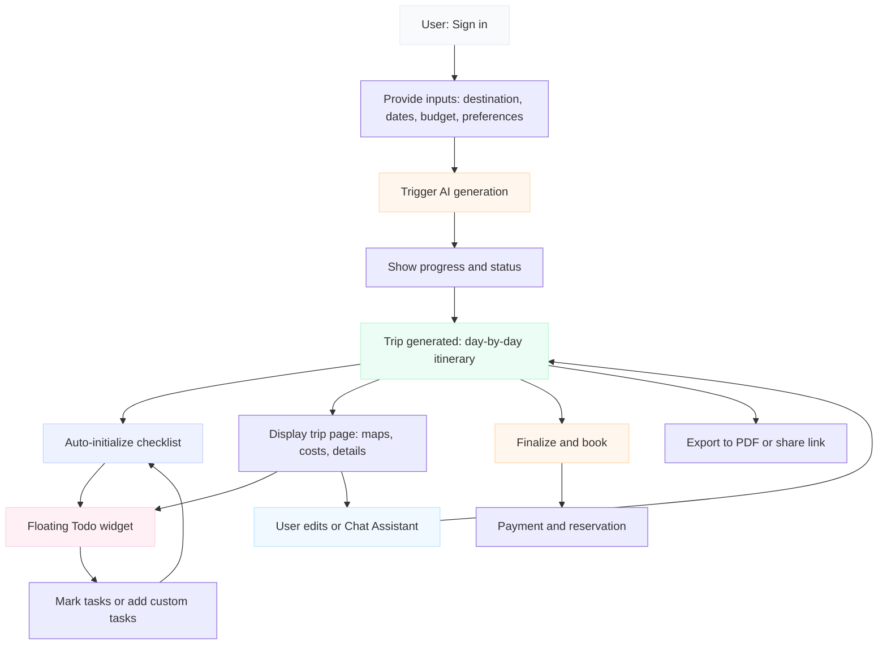

# Tripy — User Journey (Start → Finish)

This document explains the end-to-end user journey for Tripy, the value users get at each step, and includes a visual flow diagram to paste into your hackathon presentation. This file is intentionally separate from `README.md` to keep it focused on product flow.

---

## Quick overview
Tripy converts a short user prompt (or quick form) into a full, day-by-day trip itinerary. The user reviews and refines the plan, uses an auto-populated checklist for execution, and can export or book the itinerary. Real-time sync ensures everyone stays up-to-date.

---

## Key user steps (chronological)

1. Entry: Start & provide preferences
   - Action: User signs in and enters high-level inputs (destination, dates, budget, themes/interests).
   - Value: Fast capture of constraints — user invests only minutes to start a tailored plan.

2. AI generation & progress
   - Action: User triggers generation (prompt or quick form). System shows progress and status until the itinerary is ready.
   - Value: Instant value — the heavy lifting of research and sequencing is completed automatically.

3. Review & accept itinerary
   - Action: Auto-redirect to the finished trip page; user scans day-by-day plan, maps, and cost estimates.
   - Value: One clear deliverable replacing hours of manual work; immediate opportunity to accept or refine.

4. Auto-populated Trip Checklist
   - Action: System initializes day-specific todos from the itinerary (activities, confirmations, packing items). Users can add/edit/delete tasks.
   - Value: Turns recommendations into actionable tasks — improves execution and reduces missed items.

5. Quick access widget (floating)
   - Action: A compact floating widget shows progress and next tasks; user can toggle tasks from anywhere on the page and jump to the full checklist.
   - Value: Faster interactions, continuous visibility of what’s left to do without scrolling the page.

6. Real-time edits & assistance
   - Action: Use the chat assistant to ask follow-ups (e.g., "move this activity to afternoon"), or manually edit the itinerary and todos.
   - Value: Immediate personalized adjustments; plan remains usable under changing conditions.

7. Finalize & booking (one-click flow stubbed/connected)
   - Action: After review, the user confirms and books services via integrated inventory (payment + reservation step).
   - Value: Seamless transition from planning to booking, reducing friction and conversion steps.

8. Export & share
   - Action: Export the itinerary to PDF or publish a shareable public trip page.
   - Value: Easy handoff to travel companions or clients; offline access via PDF.

---

## Value at each major stage (concise)
- Input → Generate: Saves hours; one prompt becomes a detailed plan.
- Review → Accept: Immediate clarity on logistics, timelines, and cost.
- Checklist: Moves from plan to action — increases trip completion reliability.
- Widget & Sync: Continuous, low-friction access and group coordination.
- Assistance & Booking: Enables rapid iteration and simplifies the final transaction.

---

## How the system supports the journey (roles & interactions)
- Frontend: Collects user inputs, shows generation progress, displays trip page, checklist, widget, and chat assistant.
- Backend/API: Accepts requests to generate trips, initializes todos from itinerary, and mediates secure updates.
- Database (real-time): Stores trips and todos; real-time listeners propagate updates to all sessions.
- Booking Integration: (Pluggable) Inventory + payment system to complete reservations.

---

## Visual flow (Mermaid)

---

## Quick local test checklist (how to validate end-to-end)
1. Start dev server and sign in with a test account.
2. Create a new trip: enter destination, dates, budget, and a theme.
3. Confirm generation progress and automatic redirect to trip page.
4. Inspect Firestore: `trips/{tripId}` doc created and `trips/{tripId}/todos` initialized.
5. Toggle a todo in the widget and confirm update reflects in the main checklist.
6. Add a custom todo and verify it appears in both places.
7. Export PDF and verify file contains itinerary and day sections.

---

## Notes for slide / presenter
- Paste the Mermaid block into your PPT tool that supports Mermaid (or convert to PNG for static images).
- Keep the walkthrough concise: highlight generation → checklist → quick edits → booking stub.

---

*File created: `USER_JOURNEY.md` — contains step-by-step flow, value bullets, and an illustrative Mermaid diagram.*
